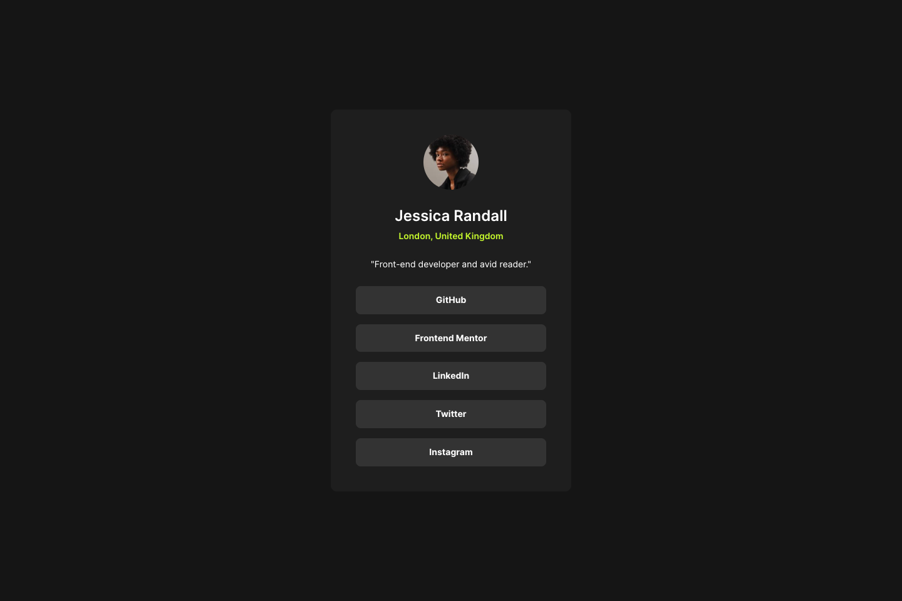

# Frontend Mentor - Social links profile solution

This is a solution to the [Social links profile challenge on Frontend Mentor](https://www.frontendmentor.io/challenges/social-links-profile-UG32l9m6dQ).
Frontend Mentor challenges help you improve your coding skills by building realistic projects.

## Table of contents

- [Overview](#overview)
  - [The challenge](#the-challenge)
  - [Screenshot](#screenshot)
  - [Links](#links)
- [My process](#my-process)
  - [Built with](#built-with)
  - [What I learned](#what-i-learned)
  - [Useful resources](#useful-resources)
- [Author](#author)

## Overview

### The challenge
Build out this social links profile and get it looking as close to the design as possible.

Users should be able to:
- View the optimal layout depending on their device's screen size
- See hover and focus states for all interactive elements on the page

### Screenshot

### Links

- Solution URL: [https://github.com/alkersan/social-links-profile](https://github.com/alkersan/social-links-profile)
- Live Site URL: [https://alkersan.github.io/social-links-profile/](https://alkersan.github.io/social-links-profile/)

## My process

### Built with

- Fluid layout
- [React](https://react.dev) - JS library
- [Styled Components](https://styled-components.com/) - For CSS
- [Vite](https://vitejs.dev) - Build tool

### What I learned

Laying out the components becomes more intuitive:
 - avoid explicit widths on blocks, only set the maximums for the containing blocks (in rem)
 - except for images and pictures - fixed width is ok 
 - the rest of the content should grow & shrink as it likes
 - centering is simpler to do with flex, rather than with grid's place-content. Flex will allow contents to grow if needed
 - don't overuse the semantic blocks within components, as those are mostly for higher level layouts

### Useful resources
 - The course [css-for-js](https://css-for-js.dev) helped me immensely.
 - [clamp() calculator](https://chrisburnell.com/clamp-calculator/)   

## Author

- Frontend Mentor - [@alkersan](https://www.frontendmentor.io/profile/alkersan)
